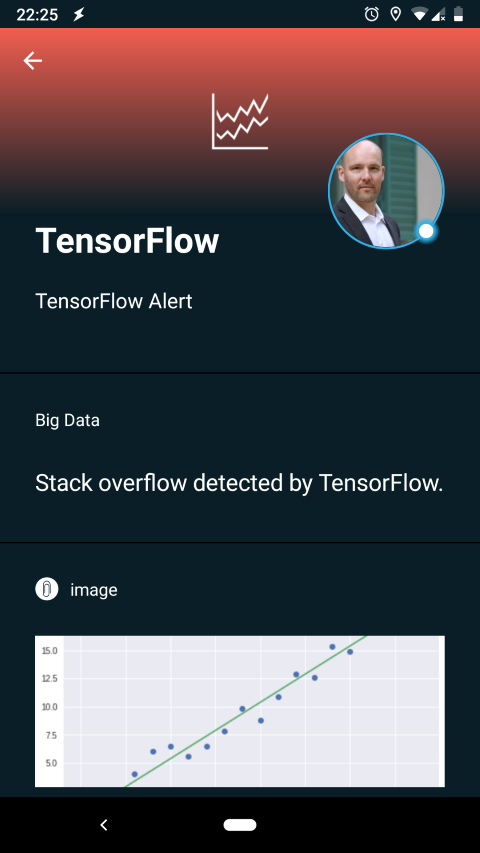
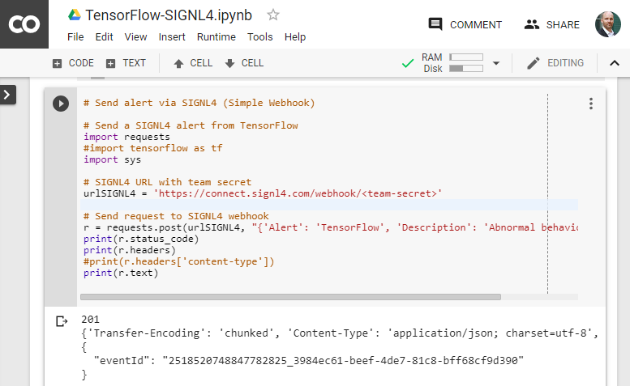

# Mobile alerting with tracking & escalation for TensorFlow
 
## Why SIGNL4

TensorFlow is an open-source software library for for high performance numerical computation. It can be used from desktops to clusters of servers to mobile and edge devices such as Raspberry Pi. TensorFlow was originally developed by Google AI researchers and comes with strong support for machine learning and deep learning and the flexible numerical computation. You can find more information at https://www.tensorflow.org.

There are various use cases possible with TensorFlow, for example the following.
- Video, image and sound recognition
- Big data analysis (e.g. financial data)
- Pre-processing of sensor data in the field
- Deep learning, risk detection, predictive maintenance, fraud detection

Pairing TensorFlow with SIGNL4 can enhance your daily operations with an extension to your mobile team.

## How it Works

All it takes to pair TensorFlow and SIGNL4 is a little code snippet that calls the SIGNL4 webhook.

Integration Capabilities
- Service engineers alerted via mobile push, text and voice
- Staff can acknowledge and take ownership for critical events that occur
- Alerts are escalated in case of no response
- Communicate within an alert to address a particular problem
- Alert on critical device states
- Two-way integration to interact or set the device state

Scenarios
- Industrial IoT
- Industry 4.0
- IoT Service Alerting
- IoT Device Management
- Finance, Security, IT, Healthcare, Manufacturing, Utility, Oil and Gas, Agriculture, etc.

## Hot to integrate

### Integrating SIGNL4 with TensorFlow

TensorFlow can be used in quite a range of different scenarios.

The following integration demonstrates demonstrates the part of sending certain information to a SIGNL4 team via an HTTP POST request.

SIGNL4 is a mobile alert notification app for powerful alerting, alert management and mobile assignment of work items. Get the app at https://www.signl4.com.

### Prerequisites
- A SIGNL4 (https://www.signl4.com) account
- Access to TensorFlow (https://www.tensorflow.org)

You can install TensorFlow for example with Python's pip package manager or you can download a TensorFlow Docker image. Find out more at https://www.tensorflow.org/install.

In our example we use TensorFlow on Colaboratory (https://colab.research.google.com), a research tool for machine learning education and research. It is free to use and requires no setup.

### Integration Steps

In Colaboratory at https://colab.research.google.com you can add a new Python 3 notebook (File -> New Python 3 notebook).

Here you can paste your Python code for sending the alert to SIGNL4.

We have prepared two Python examples you can just download from GitHub at https://github.com/signl4/signl4-integration-tensorflow.

#### Simple SIGNL4 Webhook

The file TensorFlow-SIGNL4-Inbound-Webhook.py contains a simple script to send alert data in JSON format to SIGNL4 via webhook (HTTP POST).

Please note that you need to replace the <team-secret> in the SIGNL4 URL with your own SIGNL4 team secret.

#### REST API

Besides the simple inbound webhook SIGNL4 offers a more comprehensive REST API as well.

The file TensorFlow-SIGNL4-REST-API.py used this REST API to send an alert including a diagram as base64-encoded image.

Please note that you need your SIGNL4 API Key to use the REST API. for more information on how to obtain your API Key please refer to this article: https://www.signl4.com/blog/signl4-rest-client-application-api-key.

That is it. Now you can test your code.

### Test it

Now you can test it by executing the code in Colaboratory. Just click the little Run icon on the top-left of your code. You should then receive an alert on your SIGNL4 app.
